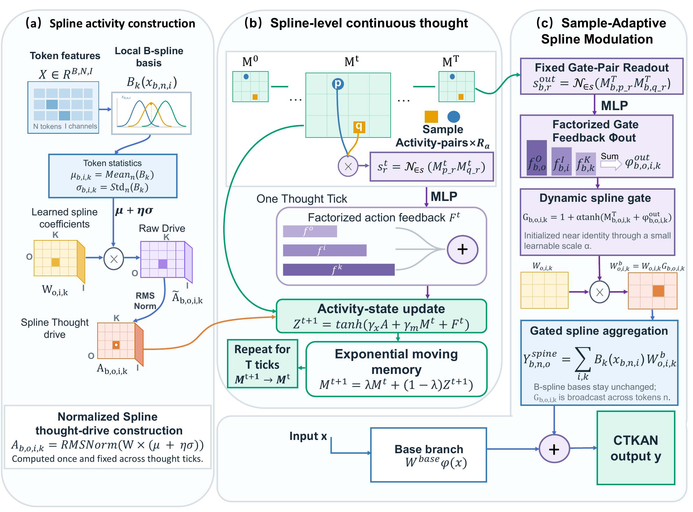
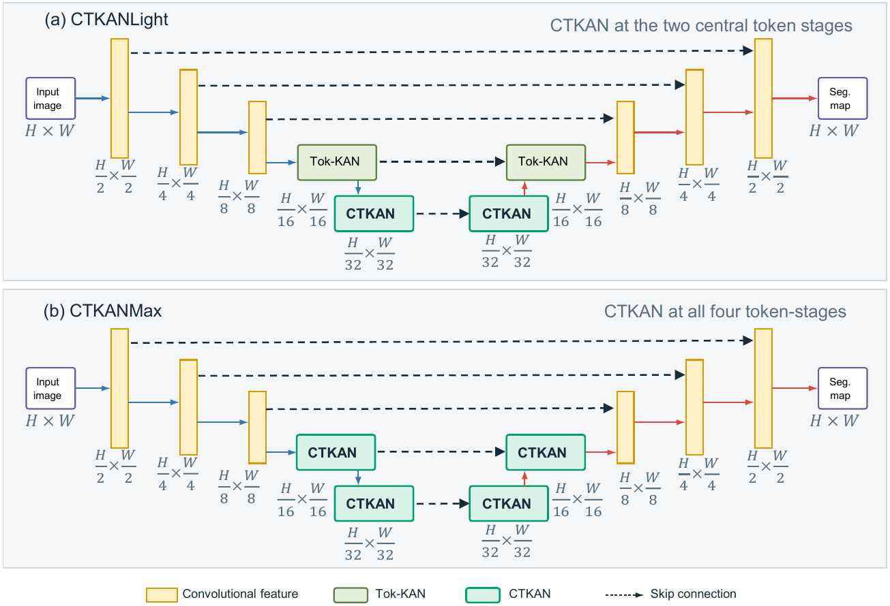
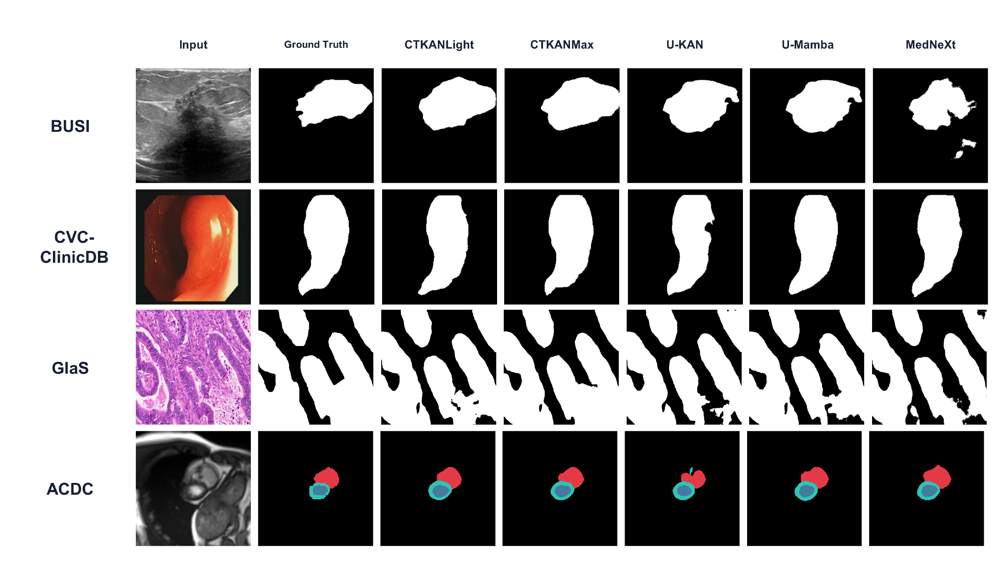
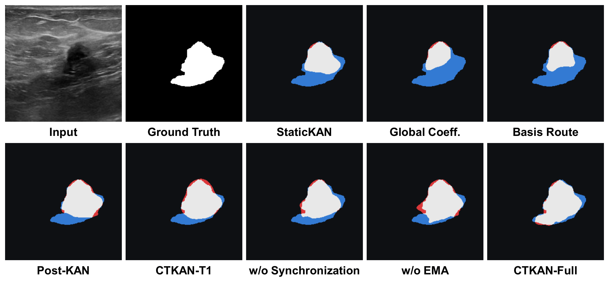
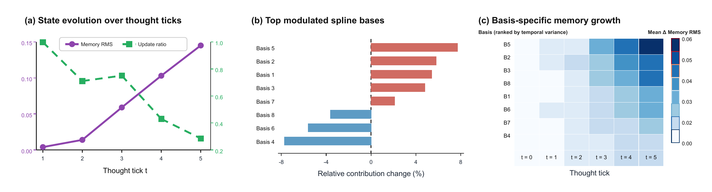
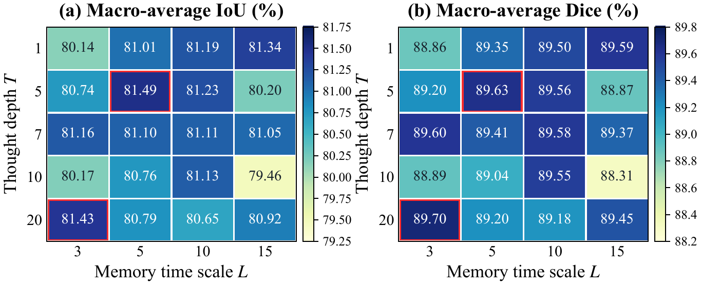

# CTKAN: Making Kolmogorov-Arnold Networks Think over Spline Activities for Medical Image Segmentation

## Abstract

Neural computation can benefit from evolving internal dynamics rather than relying solely on a single static mapping. Although Kolmogorov-Arnold Networks (KANs) have shown promise in medical image segmentation through learnable spline functions, most KAN-based models evaluate spline responses once and aggregate them immediately, preventing basis-wise contributions from being reconsidered before the layer output is formed. We argue that KANs should think over their spline activities by repeatedly refining basis contributions before aggregation, thereby strengthening nonlinear representation. As anatomical and lesion boundaries in medical images are often irregular, ambiguous, or obscured by shadows, such adaptive nonlinear representation aligns well with the need to model complex boundaries in medical image segmentation. We therefore propose CTKAN, a Continuous-Thought Kolmogorov-Arnold Network that introduces neural-dynamics-inspired recurrent evolution into the spline activity space. CTKAN maintains a sample-conditioned state for each output-input-basis triplet and updates these states over multiple thought ticks. Normalized pairwise co-activities provide relational feedback, while terminal states generate residual, sample-adaptive gates over shared spline coefficients, allowing each sample to induce a distinct mixture of spline bases. We integrate CTKAN at two deployment scales into a U-shaped segmentation backbone. Experiments on ultrasound, endoscopic, histopathological, and cardiac MRI benchmarks show that both variants outperform U-KAN, with CTKANMax improving the four-dataset macro-average by 1.29 IoU and 1.03 Dice points. These results show that making KANs think over their own spline activities improves segmentation performance through sample-adaptive spline modulation.

## Code

The repository contains the two proposed architectures and the minimum training and validation pipeline required to run them.

Key files:

- `arch/CTKANLight.py` and `arch/CTKANMax.py`: the two deployment variants.
- `train.py` and `val.py`: binary medical segmentation training and evaluation.
- `arch/common.py` and `kan.py`: shared KAN layers used by both variants.
- `smoke_test.py`: minimal forward check for both variants.

### Environment

```bash
conda create -n ctkan python=3.10 -y
conda activate ctkan
pip install -r requirements.txt
python smoke_test.py
```

The dataset directory follows the original U-KAN layout:

```text
inputs/
`-- <dataset>/
    |-- images/
    `-- masks/
        `-- 0/
```

### Example Training Command

```bash
python train.py \
  --arch CTKANLight \
  --dataset busi \
  --data_dir inputs \
  --output_dir outputs \
  --name CTKANLight_busi_seed42 \
  --epochs 300 \
  --batch_size 4 \
  --seed 42 \
  --optimizer Adam \
  --lr 1e-4 \
  --ctm_lr 1e-3 \
  --CtmTicks 5 \
  --CtmMemory 5 \
  --CtmLinearLayout first \
  --CtmPriorMode factorized
```

## Method Overview

<p align="center">
  
</p>

CTKAN contains three main stages:

1. **Spline activity extraction:** token-level spline contributions are summarized while preserving output, input, and basis identities.
2. **Recurrent co-activity evolution:** normalized pairwise co-activities provide relational feedback to the sample-conditioned memory states.
3. **Pre-aggregation refinement:** terminal states generate residual, sample-adaptive gates that modulate spline coefficients before aggregation.

## Deployment Variants

<p align="center">
  
</p>

- **CTKANLight** replaces the two central token-stage KAN blocks.
- **CTKANMax** replaces all four token-stage KAN blocks.

## Main Results

Four-dataset macro-average results are reported as mean and sample standard deviation over five training seeds. Efficiency is measured with 256 x 256 BUSI inputs on an NVIDIA GeForce RTX 5090.

| Method | Macro IoU (%) | Macro Dice (%) | Params (M) | GFLOPs | FPS |
|---|---:|---:|---:|---:|---:|
| CTKANLight | 81.34 +/- 0.32 | 89.16 +/- 0.27 | 6.73 | 5.48 | 270.27 +/- 6.46 |
| **CTKANMax** | **81.66 +/- 0.51** | **89.44 +/- 0.44** | 7.07 | 5.51 | 215.15 +/- 5.29 |
| U-KAN | 80.37 +/- 0.25 | 88.41 +/- 0.13 | 6.36 | 5.43 | 361.92 +/- 5.22 |

Relative to U-KAN, CTKANMax improves the four-dataset macro-average by 1.29 IoU and 1.03 Dice points.

## Qualitative Results

<p align="center">
  
</p>

<p align="center">
  
</p>

## Mechanism Analysis

<p align="center">
  
</p>

The diagnostics visualize state evolution, basis-specific amplification and suppression, and memory growth across thought ticks.

<p align="center">
  
</p>

## Repository Structure

```text
CTKAN-GitHub/
|-- arch/
|   |-- CTKANLight.py
|   |-- CTKANMax.py
|   |-- common.py
|   `-- __init__.py
|-- dataset.py
|-- kan.py
|-- losses.py
|-- metrics.py
|-- smoke_test.py
|-- train.py
|-- val.py
|-- README.md
`-- figures/
    `-- png/    # Images displayed in this README
```
